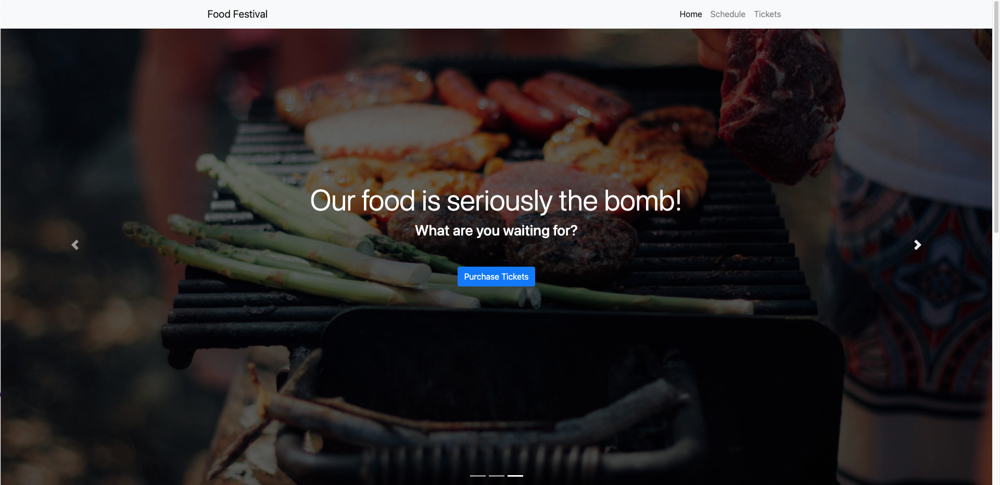

# Food Festival

## Description

This was an existing web application designed for a food festival and turned into a progressive web application—making it more performant and efficient and optimizing it for use on mobile devices.

As apps grow in size and complexity, their load times can start to lag. And when users around the world try to access those apps from aging mobile devices with spotty connections, load times can slow to a snail’s pace. That’s why performance optimization is so crucial to a good experience for every user.

To address these performance issues, Progressive Web Applications, or PWAs, blend the benefits of a traditional browser experience with those of a mobile application. PWAs can ensure applications work without an internet connection by using the Service Worker and Cache APIs to cache assets and API responses.

To deliver smaller application bundle sizes to the client, several optimizations were used through webpack; compressing assets—from minifying JavaScript and CSS files to compressing images as well as lazy loading to defer loading certain assets until they're needed by the application.

## Screen Shot

## Usage

In order to use this, you will need Node.js installed

Go to the root directory and open up the terminal, then type `npm install` to install, this will install the dependencies in the package.json file then type `npm run start:dev` to start the application

If you open up your terminal you will see `Project is running at http://localhost:8080/`, you can either click on it as a hyperlink or you can manually open up your browser and go to localhost:8080

## License

This application is not covered under any license

## Technologies

The technologies used were, Webpack, Service Workers, Node.js, HTML, CSS, Javascript

## Contributions

By Daniel Arzanipour

## Questions

[My Github](https://github.com/DanielArzani)

If you need to reach me for any additional questions, you can reach me at my [Gmail](mailto:daniel.arzanipour@gmail.com)
